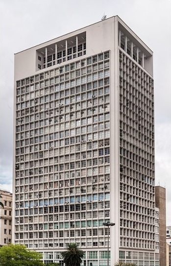
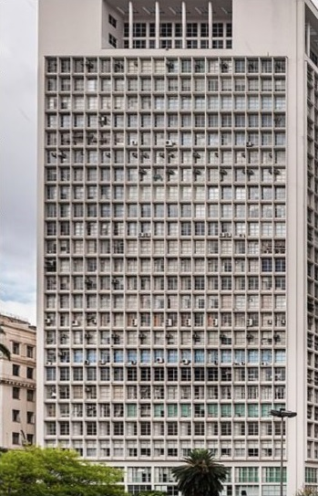

# Automatic perspective control

## Brief

A simple Python tool to automatically eliminate vanishing points on images. The following assumptions are made:

* the image is a photo of a building;
* there are two evident vanishing points: vertical and horizontal (they may not fit into the borders of the image);
* the vertical vanishing point is located above the building;
* the image contains at least 100,000 pixels.

## Example

|                        Before                         |                              After                             |
|-------------------------------------------------------|----------------------------------------------------------------|
|  |  |
